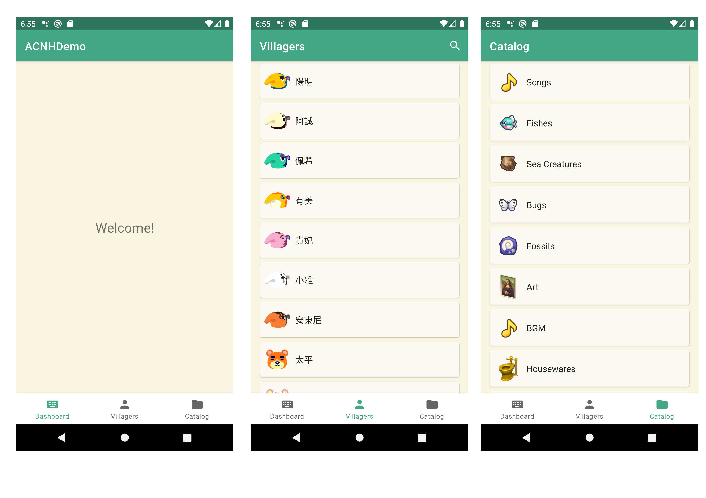
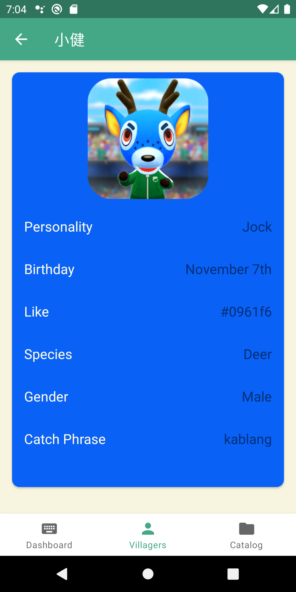
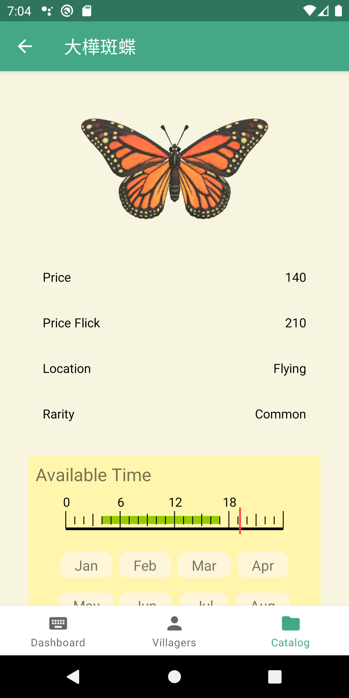

# Project Closed
This project was closed due to https://acnhapi.com/v1/ is unavailable.

# ACNHDemo

This is an Android APP Demo which build with Kotlin and Android Studio.

The App allow user browse gaming strategy of "Animal Crossing: New Horizon".

# Screenshot

Check villager's detail info.

Check catalog's info, price, available time.

# Features
Provide information of:
- Dashboard
    - Available catalog
        - fishes
        - bugs
        - sea creatures
    - Today's Birthdays
    - Today's tasks
- Villagers
- Catalog
    - Songs
    - Fishes
    - Sea Creatures
    - Bugs
    - Fossils
    - Art
    - Hourly music (BGM)
    - Houseware
    - Wallmounted

And so on. (More Features are in development)

# Development progress
## Stage 1 (Finish)
Functions to browse villagers, catalog.

## Stage 2
Dashboard's function.

# Technical Specifications
- Language: Kotlin 1.5.30
- IDE: Android Studio - Arctic Fox
- Package Management: Gradle

# Package Used
- Androidx Navigation 2.3.5
- Retrofit 2.5
- Coil 1.2.2
